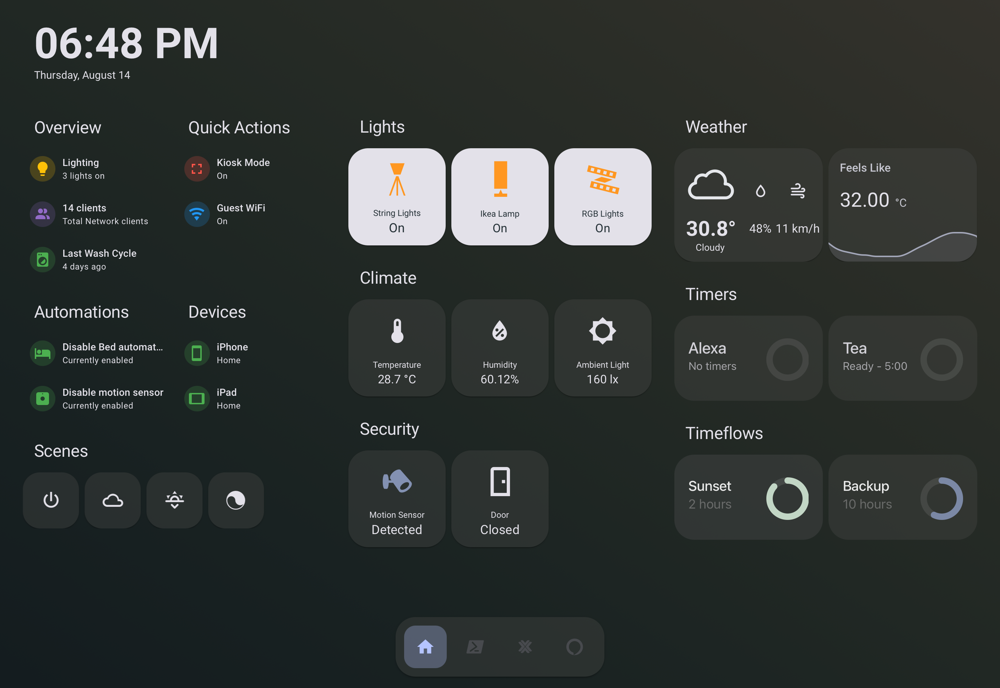
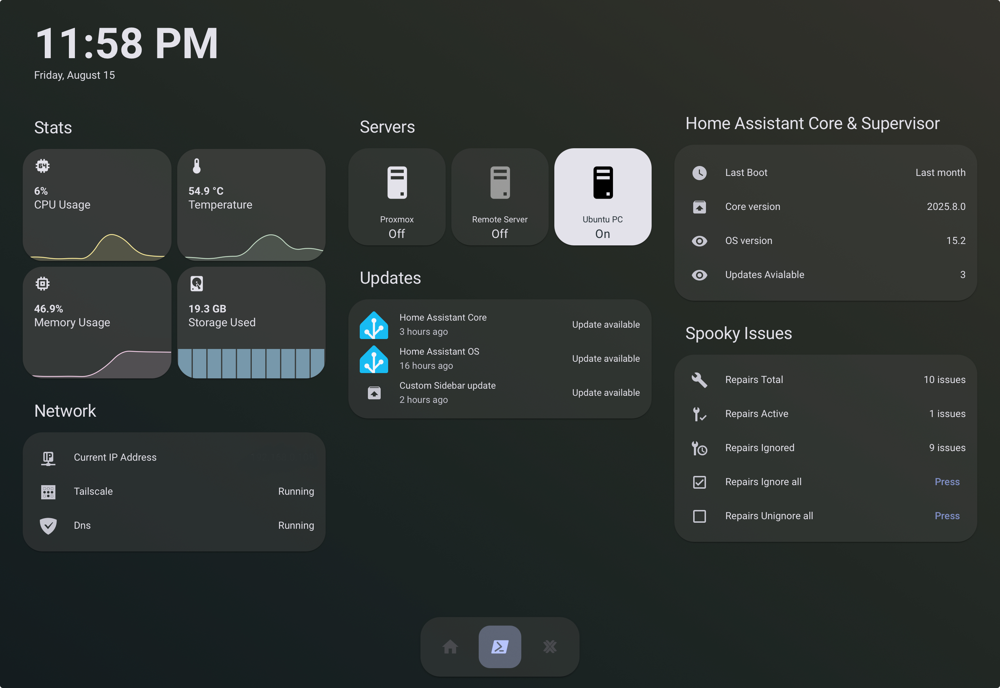

# Material-ui-Tablet-Dashboard

## How to Use

### 1\. Install the Theme

  * Copy the contents of the `material_you_gradient.yaml` file.
  * In your Home Assistant configuration directory, find the `themes` folder. If it doesn't exist, create it.
  * Inside the `themes` folder, create a new file named `material_you_gradient.yaml` and paste the contents into it.
  * Go to your user profile in Home Assistant and select "Material You Gradient" as your theme.

### 2\. Create the Dashboard

  * Copy the contents of the `dashboard.yaml` file.
  * In Home Assistant, go to **Settings \> Dashboards**.
  * Click on **Add Dashboard**.
  * Give your dashboard a name (e.g., "Tablet Dashboard").
  * Click on the three dots in the top right corner and select **Raw configuration editor**.
  * Paste the contents of `dashboard.yaml` here and save.

### 3\. Install Required Custom Cards

This dashboard uses a variety of custom cards to achieve its look and functionality. You will need to install these from the Home Assistant Community Store (HACS) for the dashboard to work correctly.

### Core Home Assistant Cards

* **`type: sections`**: This is the root element for the view, which organizes the content into sections.
* **`type: grid`**: Used to arrange cards in a grid layout.
* **`type: vertical-stack`**: Stacks cards vertically.
* **`type: markdown`**: Displays markdown content. Used for the clock and date.
* **`type: conditional`**: Shows or hides a card based on entity states. Used for unread messages and bed occupancy.
* **`type: sensor`**: A core Home Assistant card to display sensor data with a graph. Used for weather details.
* **`type: entities`**: A core Home Assistant card that lists entities. Used for network information.

---
### Custom Cards

* **`custom:timeflow-card`**: A custom card for visualizing time-based events and timers. Used for Alexa timers, tea timer, sunrise/sunset, and backups.
* **`custom:mushroom-template-card`**: A custom card from the Mushroom collection that allows for templating. Used for displaying lighting status, network clients, last wash cycle, and notifications.
* **`custom:mushroom-entity-card`**: A custom card from the Mushroom collection for displaying a single entity. Used for Kiosk Mode and Guest WiFi toggles.
* **`custom:swipe-card`**: A custom card that allows swiping through a list of other cards. Used for scenes and weather forecasts.
* **`custom:button-card`**: A highly customizable custom card that creates buttons. Used for scenes, lights, climate, and security controls.
* **`custom:gap-card`**: A custom card to add a gap or space between other cards.
* **`custom:navbar-card`**: A custom card for creating a navigation bar.
* **`custom:vertical-stack-in-card`**: A custom card that stacks cards vertically within a single card. Used for system monitoring graphs.
* **`custom:mini-graph-card`**: A custom card for creating compact graphs. Used for system monitoring.

## ✨ Small self promotion : `custom:timeflow-card`

If you like the dashboard please check out my card **`custom:timeflow-card`**. This card allows you to create beautiful, animated timers and countdownss.
In this dashboard, `timeflow-card` is used to:

  * **Track Alexa Timers**: Automatically picks up timers and displays it.
  * **Countdown to Events**: Visualize the time remaining until sunrise, sunset, or your next backup using entities
  * **Simple Timers**: Keep track of everyday timers, like for making tea.

For more info, check out the [Timeflow-card](https://github.com/Rishi8078/TimeFlow-Card)
